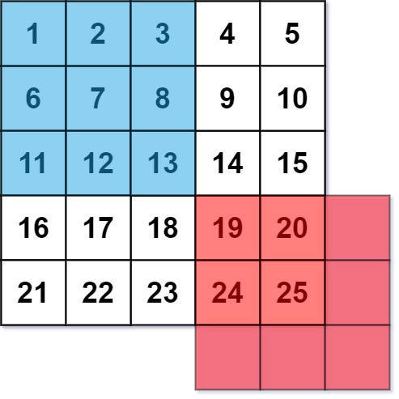
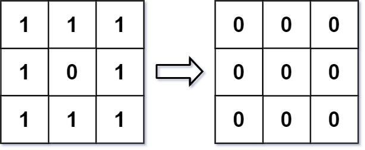
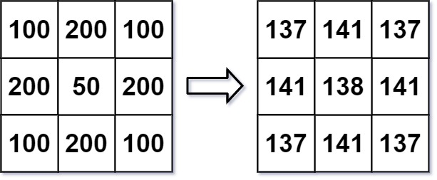

An image smoother is a filter of the size 3 x 3 that can be applied to each cell of an image by rounding down the average of the cell and the eight surrounding cells (i.e., the average of the nine cells in the blue smoother). If one or more of the surrounding cells of a cell is not present, we do not consider it in the average (i.e., the average of the four cells in the red smoother).



Given an m x n integer matrix img representing the grayscale of an image, return the image after applying the smoother on each cell of it.

 

Example 1:



Input: img = [[1,1,1],[1,0,1],[1,1,1]]
Output: [[0,0,0],[0,0,0],[0,0,0]]
Explanation:
For the points (0,0), (0,2), (2,0), (2,2): floor(3/4) = floor(0.75) = 0
For the points (0,1), (1,0), (1,2), (2,1): floor(5/6) = floor(0.83333333) = 0
For the point (1,1): floor(8/9) = floor(0.88888889) = 0


Example 2:



Input: img = [[100,200,100],[200,50,200],[100,200,100]]
Output: [[137,141,137],[141,138,141],[137,141,137]]
Explanation:
For the points (0,0), (0,2), (2,0), (2,2): floor((100+200+200+50)/4) = floor(137.5) = 137
For the points (0,1), (1,0), (1,2), (2,1): floor((200+200+50+200+100+100)/6) = floor(141.666667) = 141
For the point (1,1): floor((50+200+200+200+200+100+100+100+100)/9) = floor(138.888889) = 138
 

Constraints:

m == img.length
n == img[i].length
1 <= m, n <= 200
0 <= img[i][j] <= 255


-------------------

# Approach 1: 

- It iterates through each pixel in the input matrix and computes the average value of the pixel and its neighbors (including itself).
- For each pixel, it sums up the values of all valid neighboring pixels and then divides the sum by the count of valid neighbors to get the smoothed pixel value.
- The resulting smoothed image matrix is returned as the output.

# Complexity
## Time complexity:
O(m.n)O(m.n)O(m.n)

## Space complexity:
O(m.n)O(m.n)O(m.n)


--------------

```js
/**
 * @param {number[][]} img
 * @return {number[][]}
 */
var imageSmoother = function(img) {
    // Save the dimensions of the image.
    const m = img.length;
    const n = img[0].length;

    // Create a new image of the same dimension as the input image.
    const smoothImg = new Array(m).fill(0).map(() => new Array(n).fill(0));

    // Iterate over the cells of the image.
    for (let i = 0; i < m; i++) {
        for (let j = 0; j < n; j++) {
            // Initialize the sum and count 
            let sum = 0;
            let count = 0;

            // Iterate over all plausible nine indices.
            for (let x = i - 1; x <= i + 1; x++) {
                for (let y = j - 1; y <= j + 1; y++) {
                    // If the indices form valid neighbor
                    if (0 <= x && x < m && 0 <= y && y < n) {
                        sum += img[x][y];
                        count += 1;
                    }
                }
            }

            // Store the rounded down value in smoothImg[i][j].
            smoothImg[i][j] = Math.floor(sum / count);
        }
    }

    // Return the smooth image.
    return smoothImg;
};
```